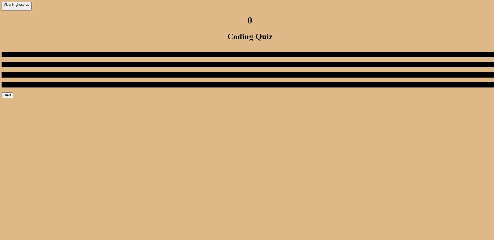

# Homework4

This app is scripted to present a short quiz on coding.
Click the button to start quiz and select desired answers as you go.

At the end it will request your initials to save your score on local storage.

Afterwards you can click the View Highscores button to see how you stack up against previous highscores.

The deployed page can be found at:

https://karpx033.github.io/Coding-Quiz/

## Known Bugs

You must enter a set of initials prior to being able to see the highscores list. Quiz will still run if highscores button is clicked before the test is taken.

